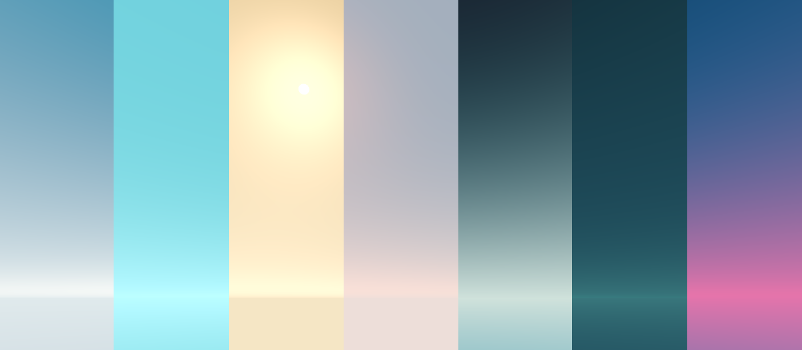
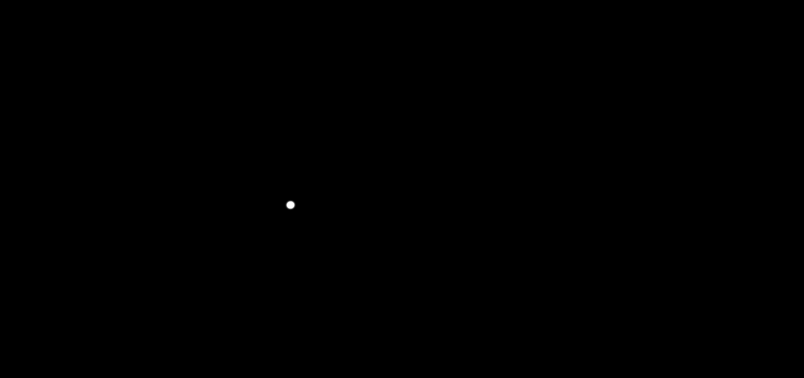

# unity-stylized-sky

A procedural stylized skybox shader for Unity.



See them all in more detail [here](../../img/a/aB5B7Zz).

## 1. How To Install

The stylized-sky package uses the [scoped registry](https://docs.unity3d.com/Manual/upm-scoped.html) feature to import
dependent packages. Please add the following sections to the package manifest
file (`Packages/manifest.json`).

To the `scopedRegistries` section:

```
{
  "name": "DSS",
  "url": "https://registry.npmjs.com",
  "scopes": [ "com.dss" ]
}
```

To the `dependencies` section:

```
"com.dss.core-utils": "1.6.2",
"com.dss.stylized-sky": "1.1.1",
```

After changes, the manifest file should look like below:

```
{
  "scopedRegistries": [
    {
      "name": "DSS",
      "url": "https://registry.npmjs.com",
      "scopes": [ "com.dss" ]
    }
  ],
  "dependencies": {
    "com.dss.core-utils": "1.6.2",
    "com.dss.stylized-sky": "1.1.1",
    ...
```

## 2. How To Use

- Open the light settings window (`Window > Rendering > Lighting Settings`).
- Drag any of the stylized sky materials from `Packages/Stylized Sky/Runtime/Materials` into the "Skybox Material" slot under the "Environment" dropdown.

## 3. Compatability

Tested on Unity 2020.3.16f1 LTS in the universal (URP) render pipeline.

## 4. Options

**Sun Disc**


**Sun Halo**


**Horizon Line**


**Sky Gradient**

